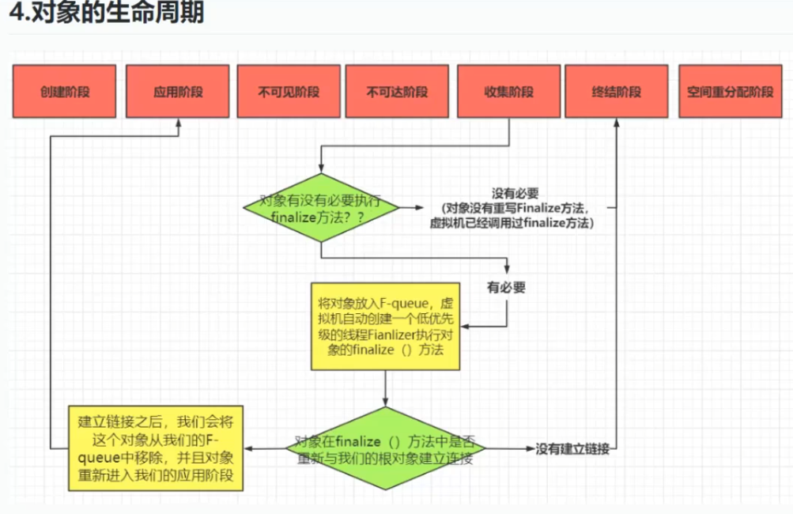

# 目录

---

### **目录：面向对象编程全景解析**

#### **第一部分：OOP核心思想与哲学**
1. **OOP的本质与目标**  
   • 从面向过程到面向对象：解决复杂性的方法论转变  
   • 核心思想：抽象、封装、协作  
   • 与函数式编程的对比：命令式 vs 声明式思维差异  

2. **OOP的历史演进**  
   • 起源：Simula 67的诞生与“对象”概念的提出  
   • 发展：Smalltalk对现代OOP范式的奠基作用  
   • 现代演进：多范式融合（如Java的Lambda、Python的类型注解）  

3. **OOP的四大支柱**  
   • 封装：信息隐藏与接口契约  
   • 继承：代码复用与层次化建模的利弊  
   • 多态：动态行为与扩展性设计  
   • 抽象：从具体到本质的思维过程  

---

#### **第二部分：OOP核心机制与技术实现**
1. **类与对象的关系**  
   • 类的三大元素：属性、方法、构造器  
   • 对象的内存模型：堆栈存储与生命周期管理  
   • 静态成员 vs 实例成员的语义区别  

2. **对象间交互模式**  
   • 关联（Association）：对象引用与协作  
   • 聚合（Aggregation）：整体与部分的弱依赖  
   • 组合（Composition）：生命周期的强绑定  
   • 依赖（Dependency）：临时性协作关系  

3. **高级OOP特性**  
   • 接口与抽象类的设计哲学  
   • 多重继承问题与解决方案（接口默认方法、Mixin）  
   • 泛型编程与类型安全（以Java/C#为例）  

---

#### **第三部分：OOP设计原则与方法论**
1. **SOLID原则详解**  
   • 单一职责原则（SRP）：模块化设计的基础  
   • 开放-封闭原则（OCP）：扩展与修改的平衡  
   • 里氏替换原则（LSP）：继承关系的约束条件  
   • 接口隔离原则（ISP）：接口粒度的控制  
   • 依赖倒置原则（DIP）：高层模块的解耦策略  

2. **GRASP模式**  
   • 高内聚低耦合的实现路径  
   • 控制反转（IoC）与依赖注入（DI）的底层逻辑  
   • 纯虚构模式：何时打破现实映射的建模规则  

3. **领域驱动设计（DDD）中的OOP应用**  
   • 实体（Entity）、值对象（Value Object）的建模差异  
   • 聚合根（Aggregate Root）对复杂关系的管理  

---

#### **第四部分：OOP在不同语言中的实践**
1. **经典静态语言实现**  
   • Java：严格的OOP规范与类型系统  
   • C++：多继承与内存管理的灵活性  
   • C#：属性访问器与LINQ的OOP扩展  

2. **动态语言特性**  
   • Python：鸭子类型与Mixin的多继承实践  
   • Ruby：元编程对OOP的增强（如Module）  
   • JavaScript：原型链与Class语法糖的本质  

3. **多范式语言融合**  
   • Scala：OOP与函数式编程的深度结合  
   • Kotlin：空安全设计与扩展函数的OOP优化  

---

#### **第五部分：OOP的工程实践与挑战**
1. **常见设计模式解析**  
   • 创建型模式：工厂方法、建造者模式  
   • 结构型模式：适配器、代理、装饰器  
   • 行为型模式：观察者、策略、状态  

2. **典型反模式与规避方法**  
   • 上帝对象（God Class）：职责过载的解决方案  
   • 循环依赖：模块解耦的技术手段  
   • 贫血模型：领域逻辑的合理分布  

3. **性能与架构权衡**  
   • 对象创建的开销优化（对象池、享元模式）  
   • 分布式系统中的OOP挑战（序列化、远程调用）  

---

#### **第六部分：OOP的争议与未来**
1. **对OOP的批评与反思**  
   • 过度设计的陷阱：简单问题复杂化  
   • 面向对象与函数式编程的融合趋势  
   • 领域驱动设计对传统OOP的修正  

2. **新兴编程范式的影响**  
   • 响应式编程（Reactive）中的对象流处理  
   • 系统级语言（如Rust）对OOP的取舍  

3. **OOP的教学与传播**  
   • 初学者常见认知误区解析  
   • 从OOP到多范式编程的学习路径建议  

# **第一部分：OOP核心思想与哲学**

------

## **第一部分 · 第一章：OOP 的本质与目标**

------

### ✳️ 1. 从面向过程到面向对象：**如何解决复杂性？**

**🧠面向过程是编年体;面向对象是纪传体**

软件开发的历史，就是人类逐渐学会**管理复杂性**的过程。

在早期（比如 C 语言时代），我们用**面向过程编程（POP）的方式开发系统——将程序视为指令的集合**，数据和操作分开，程序流程清晰，结构简单。但随着系统规模变大，这种方式逐渐暴露出两个核心问题：

- 🔁 **代码重复严重**（每个模块都自己处理逻辑）
- 🔧 **难以扩展与维护**（一改全改，牵一发而动全身）

于是，**面向对象编程（OOP）**登场了。

OOP 不是语法技巧，而是一种**解决复杂问题的建模思想**。它的核心思路是：

> 把软件世界映射为对象世界 —— 像现实中一样思考问题，而不是像计算机那样思考。

每个对象都有**状态（属性）\**和\**行为（方法）**，彼此协作完成任务。这样系统更加**模块化、可读、可扩展**。

------

### ✳️ 2. OOP 的三大核心思想：**抽象、封装、协作**

面向对象有很多概念，但真正的本质可以总结为三个字：**抽象、封装、协作**。

#### ✅ 抽象（Abstraction）：**关注共性，忽略细节**

- 通过“类”来抽象现实世界中的事物，例如“用户”“订单”“商品”。
- 目的：降低复杂度，让你不用操心每个细节，只关注本质。

#### ✅ 封装（Encapsulation）：**隐藏内部，实现对外接口**

- 对象内部数据是私有的，只通过公开的方法访问。
- 优点：数据安全、边界清晰、模块独立性强。

#### ✅ 协作（Collaboration）：**对象间互相调用，完成系统行为**

- 一个对象不是什么都干，它通过调用别的对象来完成更大的任务。
- 软件设计的关键就是设计**良好的对象协作结构**（谁负责做什么，谁与谁沟通）。

------

### ✳️ 3. OOP 与函数式编程：**命令式 vs 声明式的思想差异**

现在你可能会问：OOP 已经这么优秀了，为什么还有函数式编程（FP）？它和 OOP 有什么区别？

| 对比维度 | 面向对象编程（OOP） | 函数式编程（FP）   |
| -------- | ------------------- | ------------------ |
| 编程范式 | 命令式              | 声明式             |
| 抽象单位 | 对象（状态+行为）   | 纯函数（无副作用） |
| 状态管理 | 允许有状态变化      | 倾向无状态、不可变 |
| 协作方式 | 对象之间消息传递    | 函数组合与数据流   |

- OOP 更适合**建模复杂系统**（比如 GUI、游戏、企业系统）。
- FP 更适合**并发、高可用、数据处理**（比如 Spark、前端响应式）。

而现代语言（如 Java、Kotlin、Scala）都在**融合这两种范式**，这也反映出：**编程思想的演化从不是你死我活，而是彼此借鉴、共同发展**。

面向对象的本质，不是类和对象这些术语，而是背后的哲学：**如何像现实世界那样组织程序，让软件“长得像”问题本身。**

## **第一部分 · 第二章：OOP 的历史演进**

------

### 🕰️ **1. 概念的诞生：Simula 67**

- 1960年代，**挪威**科学家为了解决模拟系统问题，发明了 **Simula 67**。
- 首次引入了“类”和“对象”的概念，用来模拟现实中的实体（比如银行、客户、流程等）。
- 这是面向对象编程的起点。

👉 **关键词诞生**：类（Class）、对象（Object）、继承（Inheritance）

------

### 🧠 **2. 真正的奠基者：Smalltalk**

- 1970s，Alan Kay 主导的 **Smalltalk** 语言将 OOP 推向实用化。
- 一切都是对象（甚至整数、布尔值、类本身）
- 真正提出了 “面向对象” 这个术语。

👉 Smalltalk 奠定了现代 OOP 的大部分思想：
 **封装、多态、消息传递、对象即一等公民**

------

### 🚀 **3. 面向对象走向主流**

| 语言               | 贡献                 | 特点                       |
| ------------------ | -------------------- | -------------------------- |
| **C++（1983）**    | 将 OOP 加入 C 语言   | 静态类型，支持多重继承     |
| **Java（1995）**   | 推广 OOP 到企业级    | 平台无关、安全性、垃圾回收 |
| **Python（1991）** | 混合式的灵活 OOP     | 一切皆对象，支持多范式     |
| **C#（2000）**     | 微软阵营的 Java 替代 | 强类型、现代语法、LINQ     |
| **Scala / Kotlin** | 现代多范式语言       | OOP + FP 的融合            |

------

### 🔄 **4. OOP 正在演变：多范式时代**

- 现代编程不再死守某一个范式，OOP 正在与函数式编程（FP）、响应式编程（Reactive）等结合。
- 比如：
  - Java 引入 Lambda、Stream API
  - Kotlin 支持函数式表达式和扩展函数
  - Scala 完全融合 FP 与 OOP

👉 OOP 不再是**唯一主流范式**，但仍是**构建大型系统的核心思维方式之一**。

------

### ✅ 总结：

> OOP 从模拟现实走来，历经半个世纪，早已不只是技术细节，而是一种**组织复杂系统的思想框架**。

------

## **第一部分 · 第三章：OOP 的四大支柱**

------

“封装、继承、多态”是面向对象的**机制性三大特征**，而“抽象”是它们背后的**思想基础**，在系统设计中地位非常高，有时也被视为“第四大特征”。

### 🧱 **1. 封装（Encapsulation）**

#### ✅ 核心定义：

将**数据（属性）和行为（方法）**绑定在一起，并隐藏内部实现细节，对外暴露清晰接口。

**原则**:对象代表什么,就得封装对应的数据,并提供数据对应的行为

- 只暴露业务必需的接口

- 利用访问控制（private/protected/public）

- 加上不可变性（final、只读接口）进一步封装行为

  ```java
  public class Student {
      private int id;//id属性私有化
      private String name;//name属性私有化
  
      //获取id的方法
      public int getId() {
          return id;
      }
  
      //设置id的方法
      public void setId(int id) {
          this.id = id;//this关键字用来区分局部变量和成员变量
      }
  
      //获取name的方法
      public String getName() {
          return name;
      }
  
      //设置name的方法
      public void setName(String name) {
          this.name = name;
      }
  }
  ```

  

------

### 🧬 **2. 继承（Inheritance）**

#### ✅ 核心定义：

通过“**is-a**”关系，子类复用父类的属性和方法。

#### 💡 实用理解：

- 子类自动继承父类功能，可以在此基础上扩展或重写。
- 子类拥有父类对象所有的属性和方法（包括私有属性和私有方法），但是父类中的私有属性和方法子类是无法访问，**只是拥有**
- 子类可以拥有自己属性和方法，即子类可以对父类进行扩展

#### ⚠️ 常见误区：

- ❌ “继承就是为了代码复用”
- ✅ 正解是：**表达通用与特殊的关系 + 建立类型层次**

#### ⛏️ 用得太多反而是灾难：

- 子类耦合父类实现，继承层级深容易造成**脆弱设计**

- 推荐优先考虑**组合（has-a）**代替继承（is-a）

  ```java
  // 定义一个父类 Person，用于表示人
  public class Person {
      // 私有属性：姓名和年龄
      private String name;
      private int age;
  
      // 公共方法：设置姓名
      public void setName(String name) {
          this.name = name;
      }
  
      // 公共方法：获取姓名
      public String getName() {
          return name;
      }
  
      // 公共方法：设置年龄
      public void setAge(int age) {
          this.age = age;
      }
  
      // 公共方法：获取年龄
      public int getAge() {
          return age;
      }
  
      // 一种通用行为：自我介绍
      public void introduce() {
          System.out.println("My name is " + name + ", I am " + age + " years old.");
      }
  }
  
  ```

  ```java
  // Student 类继承自 Person 类，拥有 Person 的所有属性和方法
  public class Student extends Person {
      // Student 独有的属性：学号
      private int studentId;
  
      // 设置学号
      public void setStudentId(int studentId) {
          this.studentId = studentId;
      }
  
      // 获取学号
      public int getStudentId() {
          return studentId;
      }
  
      // 重写父类的 introduce 方法，实现学生特有的自我介绍(多态)
      @Override
      public void introduce() {
          System.out.println("I am a student. My name is " + getName() +
                  ", I am " + getAge() + " years old, and my student ID is " + studentId + ".");
      }
  }
  
  ```

  

------

### 🌀 **3. 多态（Polymorphism）**

#### ✅ 核心定义：

相同接口，**不同实现**；调用者不关心对象的真实类型。

#### 💡 实用理解：

- 传入 `Shape`，可能是 Circle，也可能是 Square，但都能调用 `.draw()`
- JVM 会在运行时动态绑定具体方法（动态分派）

#### ✨ 多态的好处：

- **扩展性极强**：新增类不必改旧代码
- **解耦调用者与实现**，是面向接口编程的根本

多态主要有以下三种体现方式：

###  1. **方法重写（Override）**

子类重写父类的方法，运行时根据对象实际类型调用正确的方法。

```java
继承处例子中子类 Student 重写了父类 Person 的方法 introduce()，体现了多态的一种形式——方法重写（运行时多态）。
```

### **2.方法重载（Overload）**

同一个类中多个方法同名，但参数不同。
 这是**编译时多态**（静态多态），虽然名字叫“多态”，但不具备动态分发的特性。

```java
public class Printer {
    public void print(String s) { }
    public void print(int i) { }
}

```

### 3. **接口多态（Interface-based Polymorphism）**

通过接口引用指向不同实现类的对象，也是运行时多态的一种。

```java
interface Animal {
    void speak();
}

class Dog implements Animal {
    public void speak() {
        System.out.println("汪汪！");
    }
}

class Cat implements Animal {
    public void speak() {
        System.out.println("喵喵！");
    }
}

public class Test {
    public static void main(String[] args) {
        Animal a = new Dog();
        a.speak();  // 输出 "汪汪！"

        a = new Cat();
        a.speak();  // 输出 "喵喵！"
    }
}

```

------

### 🎯 **4. 抽象（Abstraction）**

**抽象是面向对象思想的核心，但它更像一种“设计哲学”或能力**，而非单纯语法特性

#### ✅ 核心定义：

提取本质特征，忽略不必要细节，建立清晰模型。

#### ✅ 为什么常被单独列出？

因为“抽象”是：

- 面向对象“思维方式”的开端（先有抽象，才谈得上封装、继承等）
- 贯穿于类设计、建模、接口提取等各方面
- 和接口、抽象类、泛型等紧密相关

但它没有继承、多态那种“直接体现在类结构上的机制性特征”。

#### 抽象的两种形式：

- **抽象类**：包含部分实现，可被继承
- **接口（interface）**：只定义行为约定，由类去实现

------

### ✅ 总结：

> 封装隐藏复杂性，继承构建层级，多态实现扩展性，抽象建立清晰模型——它们共同塑造了 OOP 的设计力量。

| 特征 | 是否有语法结构支持              | 通常怎么理解              |
| ---- | ------------------------------- | ------------------------- |
| 封装 | ✅（private, public）            | **如何隐藏信息**          |
| 继承 | ✅（extends）                    | **如何复用行为**          |
| 多态 | ✅（Override, 多态分发）         | **如何表现差异**          |
| 抽象 | ✅（abstract class / interface） | **如何定义共性/提取本质** |

# 第二部分：OOP核心机制与技术实现

## 第二部分 · 第一章：类与对象的关系

------

### ✳️ 1. 类的三大元素：**属性、方法、构造器**

在面向对象编程中，类是对象的模板，而对象是类的实例。每个类的基本构成元素包括**属性**、**方法**和**构造器**。

#### ✅ **属性（Attributes）**：

类的属性是描述对象的状态信息，也就是对象的数据成员。例如，`Person` 类中的 `name` 和 `age` 属性就描述了一个人的姓名和年龄：

```java
public class Person {
    private String name;  // 属性：姓名
    private int age;      // 属性：年龄
}
```

#### ✅ **方法（Methods）**：

类的方法定义了对象的行为或操作。方法是类的功能实现，通过输入参数并返回结果来完成某个功能。例如，`Person` 类的 `introduce()` 方法，可以输出该人的自我介绍：

```java
public class Person {
    private String name;
    private int age;

    public void introduce() {  // 方法：自我介绍
        System.out.println("Hi, I'm " + name + " and I'm " + age + " years old.");
    }
}
```

#### ✅ **构造器（Constructors）**：

构造器是类的一种特殊方法，用于在创建对象时初始化对象的状态。构造器的名称与类名相同，且没有返回类型。通过构造器，可以给对象的属性赋初值：

```java
public class Person {
    private String name;
    private int age;

    // 无参构造器
    public Person() {
        this.name = "Unknown";
        this.age = 0;
    }

    // 带部分参数的构造器
    public Person(String name) {
        this.name = name;
        this.age = 0;
    }

    // 全参构造器
    public Person(String name, int age) {
        this.name = name;
        this.age = age;
    }
    // 拷贝构造器
    public Person(Person other) {
        this.name = other.name;
        this.age = other.age;
    }
}

```

------

### ✳️ 2. 对象的内存模型：**堆栈存储与生命周期管理**

[这个视频可以帮助你理解java的内存](https://www.bilibili.com/video/BV1dR4y1o7ER?spm_id_from=333.788.player.switch&vd_source=69dcf0781549d7aefb6c910dc44c7678&p=7)

在 Java 中，对象的内存分配主要分为堆（Heap）和栈（Stack）两个区域。

#### ✅ **堆内存（Heap）**：

堆用于存储对象的实例。当我们通过 `new` 关键字创建一个对象时，JVM 会在堆内存中为其分配空间。堆内存中的对象由垃圾回收器（GC）管理，自动进行内存回收。

#### ✅ **栈内存（Stack）**：

栈用于存储方法调用和局部变量。每次方法调用时，JVM 会为该方法分配一个栈帧，用于存储方法的局部变量和参数。当方法执行完毕时，栈帧会被销毁，局部变量也会随之消失。

[Java每日一题：对象的生命周期？【美团面试-马士兵】_哔哩哔哩_bilibili](https://www.bilibili.com/video/BV1nsC6YcE19/?spm_id_from=333.337.search-card.all.click&vd_source=69dcf0781549d7aefb6c910dc44c7678)



### ✳️ 3. 静态成员 vs 实例成员的语义区别

#### 简单类比：

- **实例成员**：像每个学生自己随身带的小本子，记录了自己的名字、爱好。
- **静态成员**：像教室黑板，写的是全班共享的信息，所有学生（对象）都能看到，也都能改。

#### ✅ **静态成员（Static Members）**：

静态成员属于类本身，而不是类的实例。所有类的实例共享同一份静态成员。静态成员通过类名直接访问，也可以通过对象来访问，但不推荐这么做。

```java
public class MathUtil {
    public static final double PI = 3.14159;  // 静态常量
    public static int add(int a, int b) {     // 静态方法
        return a + b;
    }
}

public class Test {
    public static void main(String[] args) {
        System.out.println(MathUtil.PI);    // 通过类名访问静态常量
        System.out.println(MathUtil.add(5, 10)); // 通过类名调用静态方法
    }
}
```

#### ✅ **实例成员（Instance Members）**：

实例成员属于每个对象的实例，每个对象有独立的实例成员。实例成员必须通过对象引用来访问。

```java
public class Person {
    private String name;
    private int age;

    public Person(String name, int age) {
        this.name = name;
        this.age = age;
    }

    public void introduce() {  // 实例方法
        System.out.println("Hi, I'm " + name + " and I'm " + age + " years old.");
    }
}

public class Test {
    public static void main(String[] args) {
        Person p = new Person("Alice", 30);  // 通过对象引用访问实例成员
        p.introduce();
    }
}
```

好的！我们继续完成：

------

## **第二部分 · 第二章：对象间交互模式

### ✅ 1. 直接引用：关联（Association）

📌 **一个对象中有另一个对象的引用字段。**

> 📎 类之间最常见的关系：A里面有个B，比如：

```java
public class Teacher {
    private Student student; // Teacher 持有 Student 的引用
}
```

- 生命周期不强绑定，**Teacher和Student谁先死都行**
- 类之间是“知道对方”的

🔍 关键字：has-a（拥有），双向或单向

------

### ✅ 2. 弱整体关系：聚合（Aggregation）

📌 **一个对象聚合了一组其他对象，但彼此生命周期是独立的。**

> 🧩 像班级聚合学生，班级没了，学生还活着

```java
public class ClassRoom {
    private List<Student> students; // 聚合多个学生
}
```

- 通常用在“容器类”里（班级、团队、订单列表）
- 成员可以“属于多个整体”

🔍 用法跟关联一样，只是**语义更强调：是部分，但不是附属品**

------

### ✅ 3. 强绑定关系：组合（Composition）

📌 **成员对象“完全归属”父对象，跟随它的生命周期**

> 🧱 比如电脑有 CPU，电脑没了，CPU 也被销毁

```java
public class Computer {
    private final CPU cpu = new CPU(); // 组合：电脑有且完全管理CPU
}
```

- 父对象创建时就必须创建子对象
- 子对象**不会被单独共享**

🔍 本质上就是“写死”的引用 + 生命周期跟随

------

### ✅ 4. 临时调用关系：依赖（Dependency）

📌 **对象只是在方法中临时使用另一个对象**

> ⚙️ 比如传参、工具调用，临时协作：

```java
public class OrderService {
    public void printOrder(Order order) {
        System.out.println(order.getId());
    }
}
```

- 不作为字段存在，只在方法参数、局部变量中短暂使用
- 最轻的关系，**不持有引用**

🔍 常见于业务层方法，像 Controller、Service 之间的调用

------

好嘞！我们继续保持你喜欢的风格 —— 简洁实用、代码导向、不掉书袋，来写这 **第三部分：高级OOP特性**。

------

# **第三部分：高级OOP特性（写代码就能懂的版本）**

------

## ✅ 1. 接口与抽象类的设计哲学

| 特性             | 抽象类 (`abstract class`) | 接口 (`interface`)      |
| ---------------- | ------------------------- | ----------------------- |
| 能不能有成员变量 | ✅ 可以                    | ❌ 不行（只能常量）      |
| 方法实现         | ✅ 可以部分实现            | ✅ Java 8 起可加默认实现 |
| 多继承支持       | ❌ 只能继承一个            | ✅ 可以实现多个接口      |
| 语义含义         | 是一种 **“是什么”**       | 是一种 **“能做什么”**   |

📌 **抽象类**：适合一组类有“共性实现”和“状态”的场景。

```java
abstract class Animal {
    protected String name;

    public Animal(String name) {
        this.name = name;
    }

    // 通用方法
    public void eat() {
        System.out.println(name + " is eating.");
    }

    // 抽象方法（让子类实现）
    public abstract void makeSound();
}

class Dog extends Animal {
    public Dog(String name) {
        super(name);
    }

    @Override
    public void makeSound() {
        System.out.println(name + " says: Woof!");
    }
}

```

📌 **接口**：描述能力。类可以实现多个能力。

```java
interface Flyable {
    void fly();
}
```

### [接口和抽象类有什么共同点和区别？](https://javaguide.cn/java/basis/java-basic-questions-02.html#接口和抽象类有什么共同点和区别)

------

## ✅ 2. 多重继承问题与解决方案

> Java/C# 不支持多继承类，但支持“多接口”

🧨 问题：如果两个接口提供了同名的默认实现，会冲突

```java
interface A {
    default void sayHello() {
        System.out.println("Hello from A");
    }
}

interface B {
    default void sayHello() {
        System.out.println("Hello from B");
    }
}

class C implements A, B {
    // 冲突了，必须手动解决
}
```

编译器会报错说：class C inherits unrelated defaults for sayHello() from types A and B

✅ **接口默认方法**（Java 8+）提供了解决办法

```java
class C implements A, B {
    @Override
    public void sayHello() {
        // 指定调用哪个接口的默认方法
        A.super.sayHello(); // 或者 B.super.sayHello();
    }
}

```

##  ✅ 3. 泛型编程与类型安全（以 Java 为例）

[关于“泛型”，在Java基础-机制.md也有提及](./Java基础-机制.md#泛型机制)

📌 泛型：让类/方法“模板化”，避免类型强转

```java
List<String> list = new ArrayList<>();
list.add("Hello");
String s = list.get(0); // ✅ 不需要强转
```

🎯 **目标**：代码重用 + 类型安全

📍 泛型类：

```java
class Box<T> {
    private T value;
    public void set(T v) { value = v; }
    public T get() { return value; }
}
```

📍 泛型方法：

```java
public <T> void printArray(T[] array) {
    for (T item : array) System.out.println(item);
}
```

📍 通配符 `? extends` / `? super`：

```java
List<? extends Number> nums = List.of(1, 2, 3);  // 只读安全
List<? super Integer> sink = new ArrayList<>(); // 可以 add Integer
```

✅ Java 和 C# 都支持泛型（语法略有不同）

------


